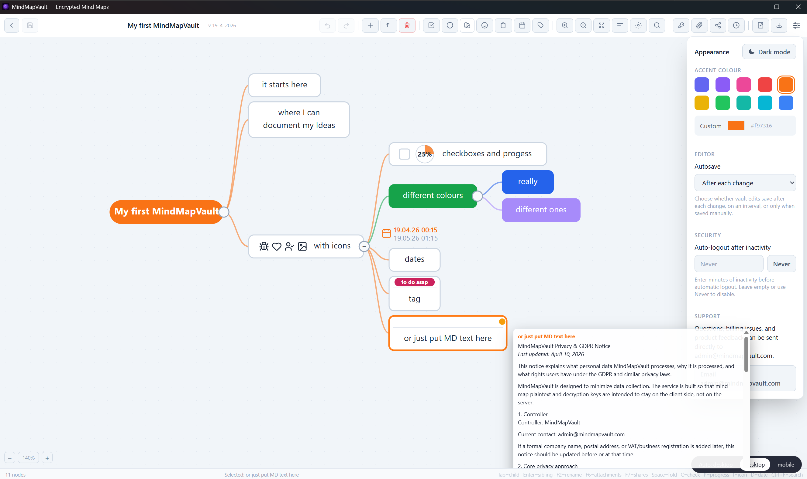

# MindMapVault Server

MindMapVault Server is the self-hosted, open-source server with backend and web UI surfaces.

It gives you full infrastructure ownership: your own server, your own storage, no third-party cloud, and the same zero-knowledge encrypted core as the desktop app.

## UI Preview


[](https://www.mindmapvault.com/)


## Demo

Interactive demo: https://mindmapvault.github.io/mindmapvault-foss/demo/

## What It Is

- **Zero-knowledge backend** — vault content is encrypted client-side before upload; the server stores only ciphertext
- **Web UI included** — the end-user app is served at `/` and the admin surface at `/admin/` from the same Docker image
- **PostgreSQL + S3-compatible storage** — works with MinIO, RustFS, or any S3-compatible endpoint
- **Encrypted blob versioning** — the server tracks encrypted versions of each vault without ever seeing plaintext
- **Encrypted share links** — share a vault by link with a passphrase the server never sees; recipients need no account, and revoking deletes the shared copy
- **Single Docker image** — one container runs the API, the web UI, and the admin surface together
- **AGPL-3 licensed**

What this server does not include: sync, offline client features, team management, enterprise governance, SSO, or audit controls. Those belong to other product lines.

## Quick Start

Pull the published image:

```bash
docker pull kornelko2/mindmapvault-server:latest
```

Or start the full local stack (PostgreSQL + S3 + server) with Docker Compose:

```bash
docker compose up -d
```

What you get:

- PostgreSQL on `127.0.0.1:5432`
- S3-compatible storage on `127.0.0.1:9000`
- MindMapVault Server on `http://localhost:8090`

**For the full deployment guide** — environment variables, volume mounts, storage setup, upgrades, and production configuration — see [`docs/DEPLOYMENT.md`](docs/DEPLOYMENT.md).

For the public OSS feature status and what is intentionally out of scope, see [`docs/OSS_FEATURES.md`](docs/OSS_FEATURES.md).

## Privacy Boundary

This project is designed for zero-knowledge-compatible workflows.

- vault content stays encrypted client-side before upload
- object storage contains encrypted blobs, not decrypted user data
- server operations do not require plaintext map payloads for normal use
- logs must not expose plaintext notes, keys, or secrets

This is a backend service, not an anonymity system. Password hygiene, endpoint protection, and safe export handling still apply.

## Repository Layout

```
backend/          Rust API, auth, storage, route handlers
frontend_app/     React web client (served at / in the packaged image)
frontend_admin/   Admin surface (served at /admin/ in the packaged image)
docker-compose.yml  Local stack: PostgreSQL, S3, server
docs/DEPLOYMENT.md  Full operator guide
tests/            Load tests and regression helpers
```

## Build From Source

Build the single-image package from the repository root:

```bash
docker build -f backend/Dockerfile -t mindmapvault-server:local .
```

Run it with an env file:

```bash
docker run --env-file .env -p 8090:8090 mindmapvault-server:local
```

## Validation

```bash
cargo check --manifest-path backend/Cargo.toml
cargo test --manifest-path backend/Cargo.toml
node scripts/check_no_committed_secrets.mjs
```

## Running This Yourself

[mindmapvault.com/homelab](https://www.mindmapvault.com/homelab/) is the page for self-hosters: what you administer, what it costs to run, and the writing about how it is built. It is kept current with what is actually shipping, and every release links back to it.

## Published Image

The same image is published to two registries on every release. Docker Hub is the default the installer and `docker-compose.yml` use; both carry identical digests, so pick whichever you prefer.

```text
kornelko2/mindmapvault-server:latest
ghcr.io/mindmapvault/mindmapvault-server:latest
```

Both are multi-arch — `linux/amd64` and `linux/arm64` — so they run on a Raspberry Pi or an Ampere VPS as well as on x86.

`latest` tracks the newest release, not the newest commit. A push to `main` publishes only a `sha-` tag; version tags and `latest` are written when a `v*` tag is pushed. Pin a version in production.

Built by `.github/workflows/build-server-image.yml`. See [docs/DEPLOYMENT.md](docs/DEPLOYMENT.md#published-images) for how publishing is wired up and how to republish a release.

## Contributing

- preserve encrypted-data boundaries
- keep backend and frontend contracts aligned
- document user-visible changes in the changelog
- run the validation steps relevant to the touched surface

## License

MindMapVault Server is released under the AGPL-3.0-or-later license. See `LICENSE` for details.
